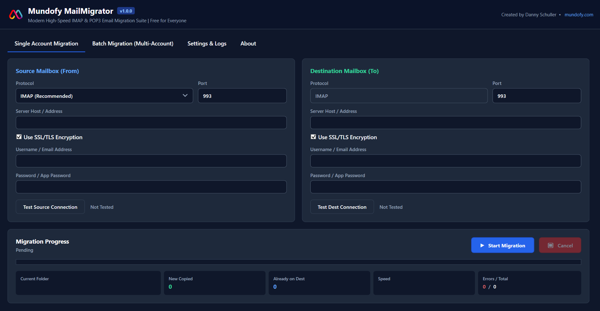
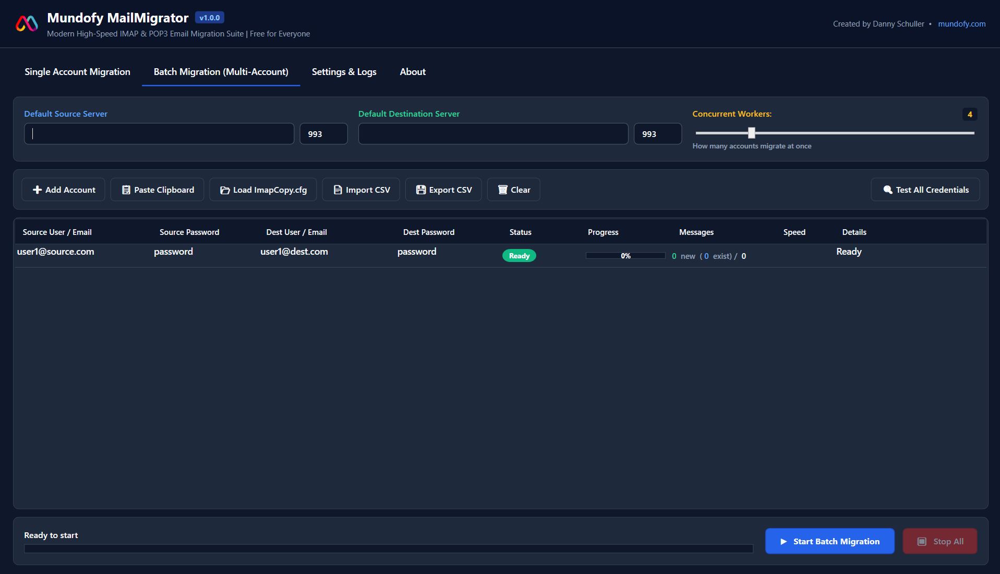

# Mundofy MailMigrator (v1.4.0)

[](https://github.com/MundofyOfficial/Mundofy-MailMigrator/releases/latest)
[](https://github.com/MundofyOfficial/Mundofy-MailMigrator/releases/latest)
[](CHANGELOG.md)
[](https://github.com/MundofyOfficial/Mundofy-MailMigrator/wiki)
[](LICENSE)

> 🚀 **[Click Here to Download MundofyMailMigrator.exe](https://github.com/MundofyOfficial/Mundofy-MailMigrator/releases/latest)**  
> *Single-file standalone Windows executable. Zero installation, zero runtime dependencies.*

> 📚 **[Browse the Full Wiki Documentation](https://github.com/MundofyOfficial/Mundofy-MailMigrator/wiki)** for comprehensive guides on Single Account Migration, Concurrency Batching, CLI Automation, and Troubleshooting.

> 🛡️ **Windows SmartScreen Note ("Windows protected your PC"):**  
> Because this is a free, newly released open-source tool without a paid Microsoft EV certificate, Windows Defender SmartScreen may display a warning when downloading via browser. Click **"More info"** ➔ **"Run anyway"** to launch.

---

## 💡 Why This Tool Was Created

As a managed hosting provider, we routinely help customers migrate their mailboxes over to our servers. Migrating email can be technically intimidating, and most users simply don't have the specialized knowledge or command-line experience to do it themselves safely without risking lost messages or downtime.

For years, the go-to tool for this job was the classic open-source **`imapcopy`** by Armin Diehl. It was simple, reliable, and sysadmins everywhere swore by it.

Over time, however, email infrastructure evolved. Mail servers began dropping older protocols and strictly enforcing **TLS 1.3**. Because classic `imapcopy` hasn't been maintained in years, connection handshakes started failing. Keeping it running required clumsy workarounds like running local `stunnel` proxy daemons, and it still lacked support for POP3, multi-threading, or modern error handling.

Patching an outdated utility was no longer the smartest way forward. So with an open mind, we asked a simple question:

> *"What if we create a modern tool that does everything imapcopy did, but so much more?"*

That idea became **Mundofy MailMigrator**:
* **Native TLS 1.3 & SSL out-of-the-box** — zero proxies or wrappers needed.
* **⚡ Zero-Config Server Auto-Discovery** — automatically resolves IMAP host, port, and SSL from any email address.
* **100% backward compatibility** with classic `ImapCopy.cfg` configuration files.
* **POP3 source support** for migrating older mailboxes that don't have IMAP enabled.
* **Concurrent multi-account batching** with an intuitive Desktop GUI alongside the CLI.
* **Smart RFC 822 Message-ID deduplication** for lossless, resume-friendly transfers.

Rather than keeping this as an internal utility, we open-sourced it for everyone. Whether you're a sysadmin managing domain migrations or someone moving an individual inbox, this tool was built to make email migration painless—and with the help of the open-source community, our goal is to make this the modern, free go-to tool for everyone.

---

## Key Features

* **⚡ Zero-Config Server Auto-Discovery**:
  * Simply enter your email address—Mundofy MailMigrator instantly detects your IMAP server host, port (993), and SSL encryption via a 5-tier discovery cascade (Major Providers, RFC 6186 DNS SRV, DNS MX Fingerprinting, Mozilla Thunderbird ISPDB, and cPanel/Plesk Autoconfig).
* **📊 Mailbox Quota Checker & Pre-Flight Capacity Guard**:
  * Query source & destination mailbox storage limits and usage in real-time (RFC 2087 IMAP QUOTA & POP3 metrics).
  * Automated pre-flight guard alerts you if destination storage is insufficient before starting migration.
* **🛡️ Native PC Sleep Prevention**:
  * Keeps your system awake during active transfers while allowing monitors to sleep.
* **🗑️ Interactive Batch Row Management & Per-Account Pause/Resume**:
  * Manage batch rows with individual pause/resume, deletion via toolbar, 1-click button, or context menu.
* **Dual Mode**:
  * **Interactive Desktop GUI**: Double-click `MundofyMailMigrator.exe` to launch the modern WPF application.
  * **Headless CLI**: Run from terminal or scripts with `-c ImapCopy.cfg` for automated migrations.
* **Protocols**:
  * **Source**: Choose **IMAP** (port 993 / 143) or **POP3** (port 995 / 110).
  * **Destination**: **IMAP** (port 993 / 143).
  * Native **TLS 1.3 / SSL** encryption out-of-the-box (no `stunnel` proxy required).
* **Direct UI Entry (No Files Needed)**:
  * Single Account Migration tab: simply type source and destination credentials directly on screen.
  * Batch Migration tab: type or paste rows into an interactive DataGrid.
* **Configurable Concurrency**:
  * Set how many mailboxes migrate simultaneously (e.g. 1 to 16 parallel workers) to maximize bandwidth.
* **Smart Deduplication & Resume**:
  * Prevents duplicate messages by checking RFC 822 `Message-ID` headers against destination folders.
* **Full Backward Compatibility**:
  * 100% compatible with existing `ImapCopy.cfg` configuration files.
  * Supports importing and exporting standard CSV and TSV account lists.
* **Zero-Install Portability**:
  * Distributed as a single self-contained `.exe` (`publish\win-x64\MundofyMailMigrator.exe`).

---

## Desktop UI Overview

### 1. Single Account Migration



1. Select protocol for the source: **IMAP** or **POP3**.
2. Enter your source server, port, email/username, and password.
3. Enter your destination IMAP server, port, email/username, and password.
4. Click **Test Source Connection** and **Test Dest Connection** to verify logins.
5. Click **▶ Start Migration**. Watch live folder traversal, message counter, transfer speed (MB/s), and progress bar.

### 2. Batch Migration (Multi-Account)



1. Set the default source and destination servers.
2. Set the **Concurrent Workers** slider (e.g. `4` accounts at once).
3. Add accounts using any of the following:
   * Click **➕ Add Account** and edit directly in the table.
   * Click **📋 Paste Clipboard** to paste rows copied from Excel or Notepad.
   * Click **📂 Load ImapCopy.cfg** to import a legacy config.
   * Click **📄 Import CSV** to import a spreadsheet.
4. Click **🔍 Test All Credentials** to verify logins in parallel.
5. Click **▶ Start Batch Migration**.

---

## CLI Usage (Automation & Scripts)

```powershell
# Show help
.\MundofyMailMigrator.exe -h

# Run with an existing ImapCopy.cfg file
.\MundofyMailMigrator.exe -c ImapCopy.cfg

# Run with 6 concurrent workers
.\MundofyMailMigrator.exe -c ImapCopy.cfg --concurrency 6

# Test logins for all accounts without transferring
.\MundofyMailMigrator.exe -c ImapCopy.cfg --test
```

---

## Building from Source

Prerequisites: [.NET 8.0 SDK](https://dotnet.microsoft.com/download/dotnet/8.0)

```powershell
# Build solution
dotnet build

# Run unit tests
dotnet test

# Publish single-file portable Windows executable
dotnet publish src\Mundofy.MailMigrator.App\Mundofy.MailMigrator.App.csproj -c Release -r win-x64 --self-contained -p:PublishSingleFile=true -o publish\win-x64
```

---

## 💡 Planned Features & Upcoming Ideas

Here is a list of features, community requests, and enhancements currently being investigated for implementation in upcoming updates:

* **📅 Date Range Filtering:** Option to migrate only emails newer than a specified date (e.g., *"last 1 year"* or custom date range) to conserve storage quota.
* **🗑️ Folder Exclusion Filters:** Options to easily exclude `Trash`, `Spam`, and `Junk` folders to save bandwidth.
* **🔄 Smart Folder Normalization:** Automatic mapping between different provider naming conventions (e.g., `Sent Items` ➔ `Sent`, `Deleted Items` ➔ `Trash`).
* **📊 Exportable Migration Audit Reports:** One-click generation of comprehensive CSV and printable HTML reports (mailbox status, bytes transferred, messages skipped, duration).
* **🔁 1-Click "Retry Failed Only":** Instantly re-queue only failed accounts or interrupted items without re-evaluating completed mailboxes.
* **⚡ Bandwidth Throttling / Rate Limiting:** Configurable rate limits to prevent aggressive server throttling (HTTP/IMAP 429 / connection limits).
* **🔐 OAuth 2.0 / Modern Authentication:** Interactive browser login for Microsoft 365 and Google Workspace without requiring app passwords.
* **🐧 Cross-Platform Linux & Docker CLI:** Native lightweight Linux binary (`linux-x64`, `linux-arm64`) and official Docker container for automated server pipelines. The classic `imapcopy` was our inspiration after all, but is unfortunately getting outdated—bringing modern TLS 1.3, POP3, and multi-threading back to Linux and containers is a natural continuation of that legacy.

> 💬 Have an idea or need a specific feature? Feel free to open a feature request on our [GitHub Issue Tracker](https://github.com/MundofyOfficial/Mundofy-MailMigrator/issues)!

---

## Credits & License

* **Product**: Mundofy MailMigrator
* **Author**: Danny Schuller
* **Company**: Mundofy
* **Heritage**: Inspired by the original `imapcopy` by Armin Diehl (2001–2009).
* **IMAP / POP3 Engine**: Powered by [MailKit](https://github.com/jstedfast/MailKit) by Jeffrey Stedfast.
* **License**: Free and Open Source for Everyone under the [MIT License](LICENSE).
